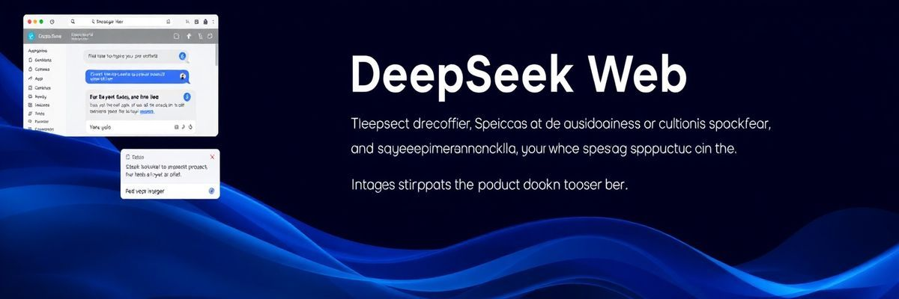

# DeepSeek Web - VS Code Extension

Embed [DeepSeek Chat](https://chat.deepseek.com/) directly into your VS Code sidebar. This extension allows you to interact with DeepSeek Chat without leaving your editor.

## Features

- **Embed DeepSeek Chat**: Access DeepSeek Chat in a Webview panel within VS Code.
- **Customizable Chat URL**: Configure the URL of the DeepSeek Chat instance you want to use (e.g., for self-hosted instances).

## Installation

1. Open VS Code.
2. Go to the Extensions view by clicking on the Extensions icon in the Activity Bar on the side of the window or by pressing `Ctrl+Shift+X`.
3. Search for "DeepSeek Web".
4. Click the **Install** button.

Alternatively, you can install the extension from the [Visual Studio Code Marketplace](https://marketplace.visualstudio.com/items?itemName=Kingleo.deepseek-web).

## Usage

### Open DeepSeek Chat

1. Click the DeepSeek icon in the Activity Bar.
2. Alternatively, use the command palette (`Ctrl+Shift+P`) and search for `Open DeepSeek Chat`.

### Customize Chat URL

1. Open VS Code settings (`Ctrl+,`).
2. Search for `DeepSeek Web`.
3. Update the `Chat URL` field with the desired DeepSeek Chat instance URL.

## Commands

| Command               | Description                     |
| --------------------- | ------------------------------- |
| `deepseek.openChat` | Open the DeepSeek Chat Webview. |

## Configuration

| Setting                 | Default Value                  | Description                                     |
| ----------------------- | ------------------------------ | ----------------------------------------------- |
| `deepseekWeb.chatUrl` | `https://chat.deepseek.com/` | The URL of the DeepSeek Chat instance to embed. |

## Contributing

Contributions are welcome! If you'd like to contribute, please follow these steps:

1. Fork the repository.
2. Create a new branch for your feature or bugfix.
3. Make your changes and commit them.
4. Submit a pull request.

## License

This project is licensed under the MIT License. See the [LICENSE](LICENSE) file for details.

## Acknowledgements

- [DeepSeek](https://www.deepseek.com/) for providing the AI-powered chat interface.
- [VS Code](https://code.visualstudio.com/) for the extensible editor platform.

---

Enjoy seamless integration with DeepSeek Chat! 🚀
